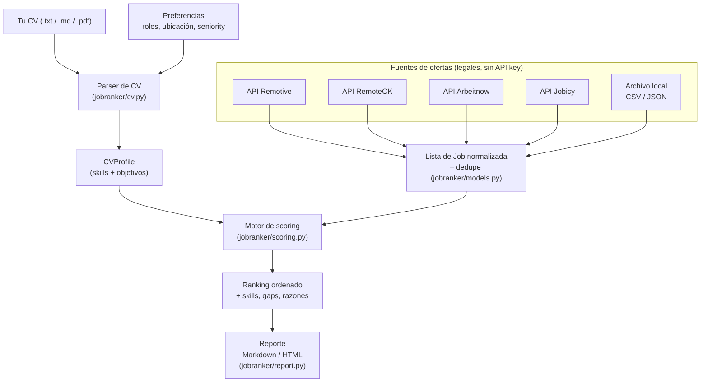

# jobranker — analizador y rankeador de ofertas de empleo

`jobranker` lee **tu CV**, trae ofertas de empleo desde **fuentes legales y
gratuitas (sin API key)** y las **puntúa y ordena (0–100)** según qué tan bien encajan con tu perfil y tus
objetivos de carrera. Genera un ranking explicado (Markdown o HTML) para que
**tú** decidas a cuáles aplicar.

## Finalidad del proyecto

Buscar trabajo manualmente es lento: hay que leer decenas de ofertas y adivinar
cuáles valen la pena. Este proyecto automatiza el **análisis y la priorización**
de ofertas:

- Detecta tus skills a partir del CV.
- Puntúa cada oferta por encaje (skills, rol, ubicación, seniority, recencia).
- Te dice **por qué** encaja cada oferta y **qué te falta** (posibles gaps).
- Te entrega un ranking listo para revisar.

### Por qué NO toca LinkedIn

Automatizar LinkedIn (scrapear ofertas, auto-aplicar, enviar mensajes con bot)
**viola los Términos de Servicio de LinkedIn** y puede llevar al **baneo
permanente** de tu cuenta. Por eso `jobranker` es deliberadamente **de solo
lectura y con humano en el control**:

- Nunca inicia sesión en LinkedIn ni en ninguna cuenta.
- Nunca aplica ni envía tu CV automáticamente.
- Solo **rankea** ofertas de fuentes legales; **tú** das el clic de aplicar.

## Diagrama de flujo



## Fuentes de ofertas

Todas las fuentes en vivo son **gratuitas y sin API key**. Puedes combinar
varias en una sola corrida; las duplicadas (mismo título + empresa) se eliminan
automáticamente.

| Fuente | Flag | Notas |
|--------|------|-------|
| [Remotive](https://remotive.com) | `--remotive` | Empleos remotos. Enlazamos a la URL original y damos crédito según sus términos. |
| [RemoteOK](https://remoteok.com) | `--remoteok` | Empleos remotos. Sus términos piden enlace *do-follow* de vuelta y crédito a "Remote OK". |
| [Arbeitnow](https://www.arbeitnow.com) | `--arbeitnow` | Bolsa de empleo (API paginada). |
| [Jobicy](https://jobicy.com) | `--jobicy` | Empleos remotos, con filtros `--search` y `--geo`. |
| Archivo local | `--file ruta.csv\|.json` | Ofertas que recolectas tú (incluida una copiada de LinkedIn a una fila). Sin scraping. |

> Más adelante se pueden añadir proveedores con más cobertura (Adzuna, JSearch);
> esos sí requieren una API key gratuita.

## Requisitos

- **Python 3.9+** (probado en 3.12).
- `pip`.
- Conexión a internet **solo** si usas fuentes en vivo (`--remotive`,
  `--remoteok`, `--arbeitnow`, `--jobicy`). Con archivos locales funciona offline.
- Dependencia principal: `requests`. Opcionales: `pypdf` (CV en PDF) y
  `pytest` (tests).

## Instalación local

```bash
git clone https://github.com/JaunMarin423/job-offer-analyzer.git
cd job-offer-analyzer

# (recomendado) entorno virtual
python -m venv .venv && source .venv/bin/activate   # Windows: .venv\Scripts\activate

# instala el paquete en modo editable
pip install -e .            # núcleo
pip install -e ".[pdf]"     # + soporte de CV en PDF (pypdf)
pip install -e ".[dev]"     # + pytest para correr los tests
```

Tras instalar, queda disponible el comando `jobranker`. (También puedes
ejecutarlo sin instalar con `python -m jobranker ...`).

## Comandos / scripts disponibles

| Comando | Para qué sirve |
|---------|----------------|
| `jobranker --cv <CV> ...` | Ejecuta el analizador y genera el ranking. |
| `python -m jobranker ...` | Igual que arriba, sin instalar el script. |
| `pytest -q` | Corre la suite de pruebas (16 tests). |
| `jobranker --help` | Muestra todas las opciones disponibles. |

### Opciones del CLI

| Opción | Descripción |
|--------|-------------|
| `--cv PATH\|TEXT` | **(requerido)** Ruta a tu CV (.txt/.md/.pdf) o el texto del CV. |
| `--roles` | Roles objetivo separados por coma, ej. `"backend developer,data analyst"`. |
| `--locations` | Ubicaciones/modalidad preferidas, ej. `"remote,worldwide,colombia"`. |
| `--seniority` | `junior` / `mid` / `senior` (si no, se infiere del CV). |
| `--skills` | Skills extra a sumar a las detectadas en el CV. |
| `--remotive` | Trae ofertas en vivo de la API gratuita de Remotive. |
| `--remoteok` | Trae ofertas en vivo de la API gratuita de RemoteOK. |
| `--arbeitnow` | Trae ofertas en vivo de la API gratuita de Arbeitnow. |
| `--jobicy` | Trae ofertas en vivo de la API gratuita de Jobicy. |
| `--search` | Búsqueda aplicada a **todas** las fuentes elegidas. |
| `--category` | Slug de categoría de Remotive, ej. `software-dev`. |
| `--geo` | Filtro geográfico de Jobicy, ej. `usa`, `latin-america`. |
| `--source-limit` | Máximo de ofertas por cada fuente en vivo (def. 100). |
| `--file PATH` | Carga ofertas de un CSV/JSON local (se puede repetir). |
| `--top N` | Muestra solo las N mejores (0 = todas). Def. 20. |
| `--min-score` | Descarta ofertas por debajo de este puntaje (0–100). |
| `--format` | `markdown` (def.) o `html`. |
| `-o, --output PATH` | Escribe el reporte a un archivo. |

> Debes elegir al menos una fuente: `--remotive`, `--remoteok`, `--arbeitnow`,
> `--jobicy` y/o `--file PATH`. Las ofertas duplicadas (mismo título + empresa)
> se eliminan automáticamente al combinar fuentes.

## Cómo ejecutar (ejemplos)

**1) Ofertas en vivo (Remotive) contra tu CV → Markdown:**

```bash
jobranker --cv mi_cv.pdf \
  --roles "backend developer,python developer" \
  --locations "remote,worldwide,colombia" \
  --remotive --search "python backend" --source-limit 50 \
  --top 15 -o ranking.md
```

**2) Ofertas de un CSV propio (offline) → consola:**

```bash
jobranker --cv examples/sample_cv.txt --file examples/sample_jobs.csv --top 10
```

**3) Combinar TODAS las fuentes gratuitas → reporte HTML:**

```bash
jobranker --cv mi_cv.md \
  --roles "fullstack developer,backend developer,react developer" \
  --locations "remote,worldwide,latam,colombia" --seniority senior \
  --remotive --remoteok --arbeitnow --jobicy \
  --source-limit 100 --min-score 30 \
  --top 15 --format html -o ranking.html
```

### Probar rápido con los datos de ejemplo

El repo incluye `examples/sample_cv.txt` y `examples/sample_jobs.csv`:

```bash
jobranker --cv examples/sample_cv.txt \
  --roles "backend developer" --locations "worldwide,remote" \
  --file examples/sample_jobs.csv --top 5
```

### Formato del archivo local

Cabecera CSV o claves JSON (solo `title` es obligatorio):

```
title, company, location, description, url, salary, job_type, category,
tags, publication_date
```

`tags` puede ser una cadena separada por comas o una lista JSON. Ver
[`examples/sample_jobs.csv`](examples/sample_jobs.csv). Así puedes analizar una
oferta que copiaste de LinkedIn pegándola como una fila, sin scraping.

## Cómo funciona el puntaje

El puntaje 0–100 es una mezcla ponderada y **transparente**, para que cada
ranking sea explicable:

| Componente | Peso | Qué mide |
|------------|-----:|----------|
| skills     | 50%  | coincidencia entre tus skills y la oferta |
| role       | 25%  | título de la oferta vs. tus roles objetivo |
| location   | 15%  | ubicación de la oferta vs. tus preferencias |
| seniority  | 5%   | alineación junior/senior |
| recency    | 5%   | qué tan reciente es la publicación |

Cada oferta del ranking lista las skills coincidentes, los posibles gaps y el
desglose por componente.

## Estructura del proyecto

```
job-offer-analyzer/
├── jobranker/
│   ├── cli.py            # interfaz de línea de comandos
│   ├── cv.py             # lectura de CV y extracción de skills
│   ├── models.py         # modelos Job y CVProfile
│   ├── scoring.py        # motor de puntaje/ranking
│   ├── report.py         # render Markdown / HTML
│   └── sources/          # fuentes (Remotive, RemoteOK, Arbeitnow, Jobicy, local)
├── examples/             # CV y ofertas de ejemplo
├── tests/                # pruebas con pytest
└── pyproject.toml
```

## Tests

```bash
pytest -q
```

## Roadmap

- Más proveedores legales (Adzuna, JSearch, Jooble) detrás de API keys.
- Adaptación opcional de CV/carta por oferta (siempre revisada por un humano).
